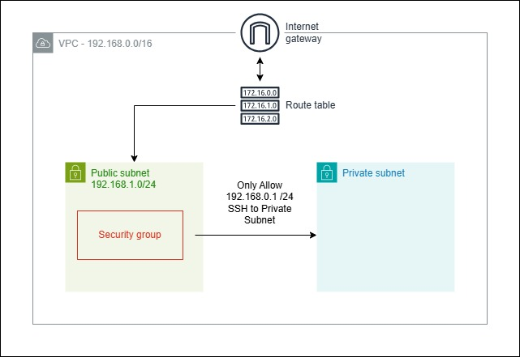

# Introduction

This repository contains a project of Terraform code for provisioning the necessary AWS VPC resources using a modular approach. IPv6 support is not included in this project; it is currently limited to IPv4-based configurations only.

# Project Versioning

| Version | Date      | Description           |
| ------- | --------- | --------------------- |
| ~ 0.0.1 | June 2025 | First version of code |

# Prerequisites for the Prototype

1. Set up a GitHub repository to manage project version control and showcase the project to the community.
2. Preparing the Terraform code to provisioning the VPC

# File Structure Overview

    .
    ├── main.tf # Root module
    ├── variables.tf
    ├── outputs.tf
    ├── modules/
    │ └── vpc/
    │ ├── main.tf
    │ ├── variables.tf
    │ └── outputs.tf

# Steps to Create the VPC for this project with explanation

For VPC Resources:

1. Execute linux command at root directory: mkdir -p modules/vpc
2. Command to create main.tf, variables.tf and output.tf files, with command: touch modules/vpc/<filename>
3. Define the default variables in modules/vpc/variables.tf:
   - Project name
   - VPC CIDR Block, Public and Private CIDR Block
   - Public and Private Availability Zone
   - Internet Gateway
   - Route Table
   - Associate Route Table
4. Resources in the modules/vpc/main.tf:
   - VPC (Virtual Private Cloud)
   - Each single public and private subnet with availability zones
   - Internet Gateway
   - Route Table and attached route table to public subnet
5. Create Output for reviewing the result in modules/vpc/outlet.tf:

For Security Group:

1. Execute linux command at root directory: mkdir -p modules/security-group
2. Command to create main.tf, variables.tf and output.tf files, with command: touch modules/security-group/<filename>
3. Define the default variables in modules/security-group/variables.tf:
   - Project Name
   - Security group name
   - Security group description
   - Security group vpc id (Associate VPC ID)
   - Security group ingress
   - Security group egress
4. Resources in the modules/security-group/main.tf:
   - Security Group
   - Security Group Rule - Ingress & Egress
5. Create Output for reviewing the result in modules/security-group/outlet.tf:

In root directory:

1. Command to create main.tf and variables.tf files, with command: touch <filename>
2. Define the default variables in variables.tf
   - Region
   - Profile
   - Project name
3. In main.tf: Use modules to provision VPC and security groups

# Initial, execute plan and apply the plan to real infrastructure

terraform init
terraform plan
terraform apply

# Summary

The core idea of this project is to use Terraform modules to organize infrastructure code. Each resource (such as VPC and Security Group) is defined inside its respective module folder. The root-level main.tf calls these modules to provision infrastructure.

This modular approach makes the code more organized, reusable, and easier to manage across different environments or projects.

Result with diagram:

